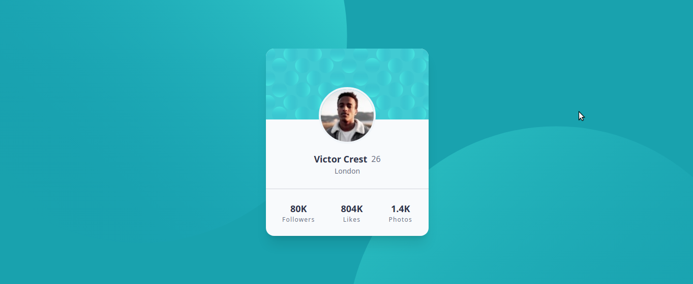
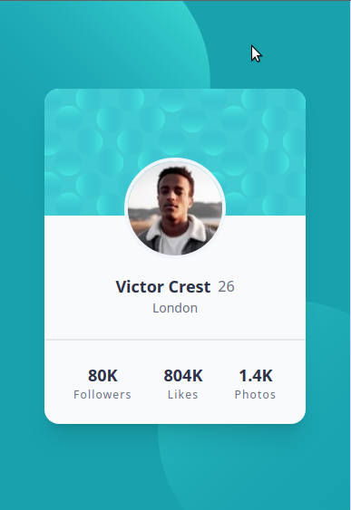

# Project-01: Profile Card Component

This is a solution to the [Profile card component challenge on Frontend Mentor](#https://www.frontendmentor.io/challenges/profile-card-component-cfArpWshJ)

## Table of Contents

- [Overview](#overview)
  - [Screenshot](#screenshot)
  - [Links](#links)
- [My process](#my-process)
  - [Tools used](#tools-used)
  - [Challenges faced](#challenges-faced)
  - [Lessons learned](#lessons-learned)
- [Author](#author)

## Overview

This is my first practice project from Frontend Mentor in this "newbie" series where I use ReactJS and TailwindCSS to make all projects.

### Screenshot

Down below I've added the screenshot of my project final results.

Desktop View:

Mobile View:

## My process

### Tools used

Following are the tools/languages that were used to build this project.

- React
- React DOM
- Create-react-app
- TailwindCSS
- JavaScript
- Node to install all the dependencies

### Challenges faced

I faced one major challenge while creating this project.

- I used TailwindCSS for the first time and hence was finding hard to implement the classes declared in Tailwind. Though the understood core concepts of Tailwind, still to apply those classes, I had to constantly search and keep applying.

### Lessons learned

This project was a good starter for me to put my React and Tailwind knowledge to practice. I learned a lot about how Tailwind works and why it is preferred in the developer community.

The idea of styling components without writing any custom css and leaving the HTML/JSX is really powerful.

## Author

- My GitHub - [Devang Vishnu](https://github.com/thedevangvishnu)
- Frontend Mentor - [@thedevangvishnu](https://www.frontendmentor.io/profile/thedevangvishnu)
